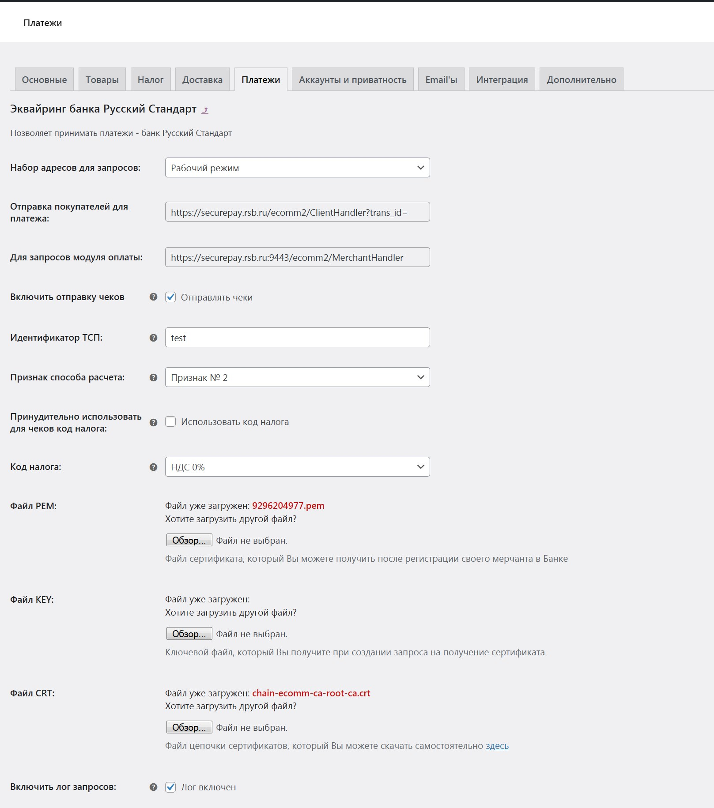
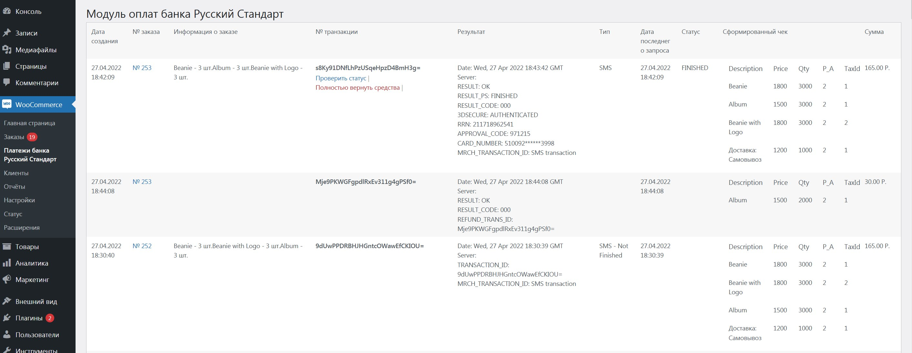
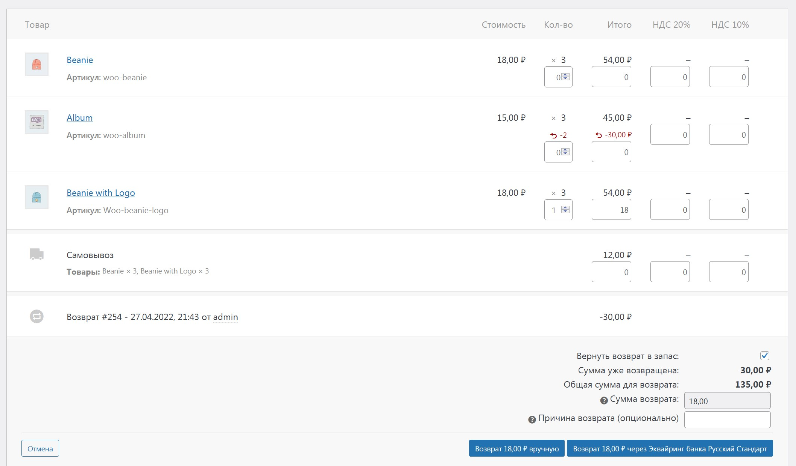
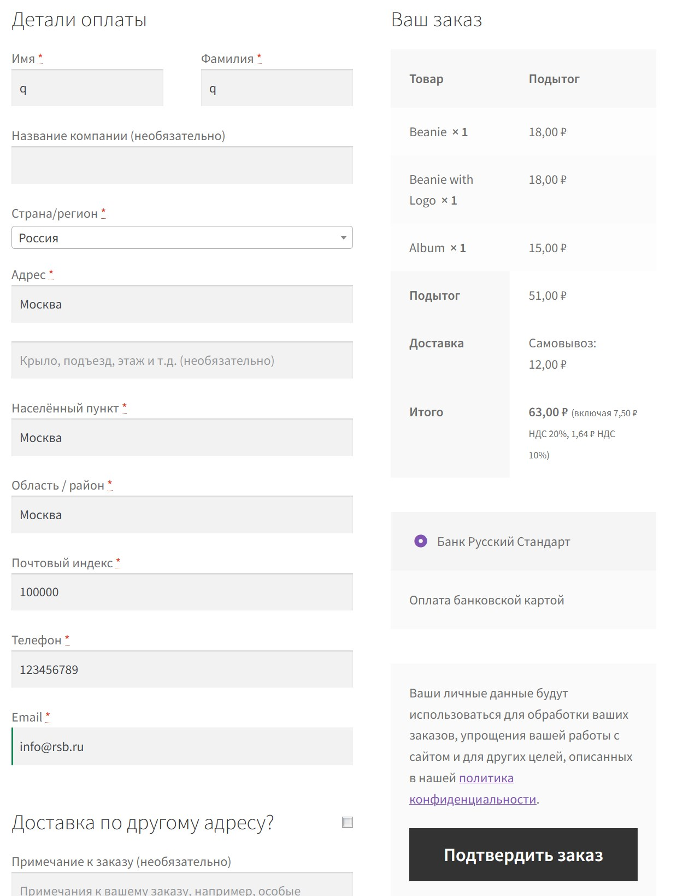
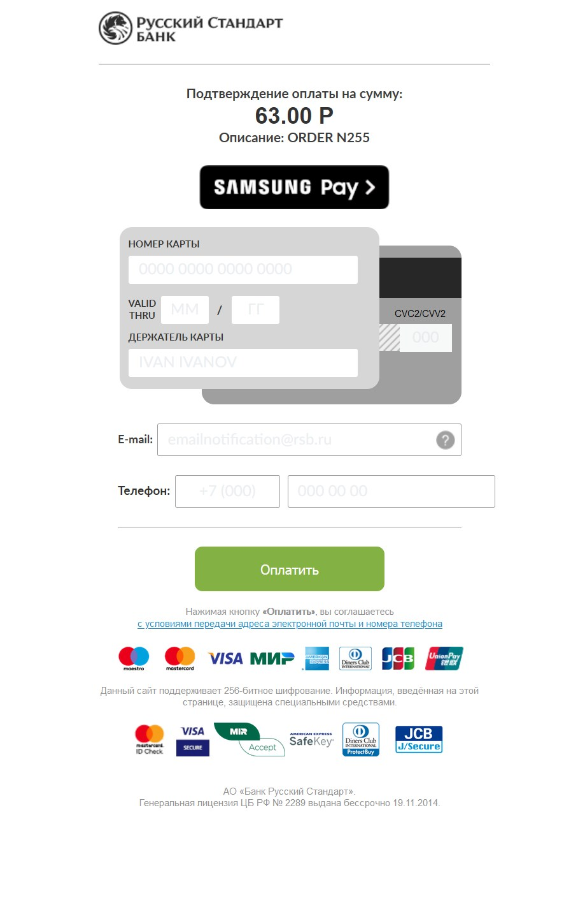
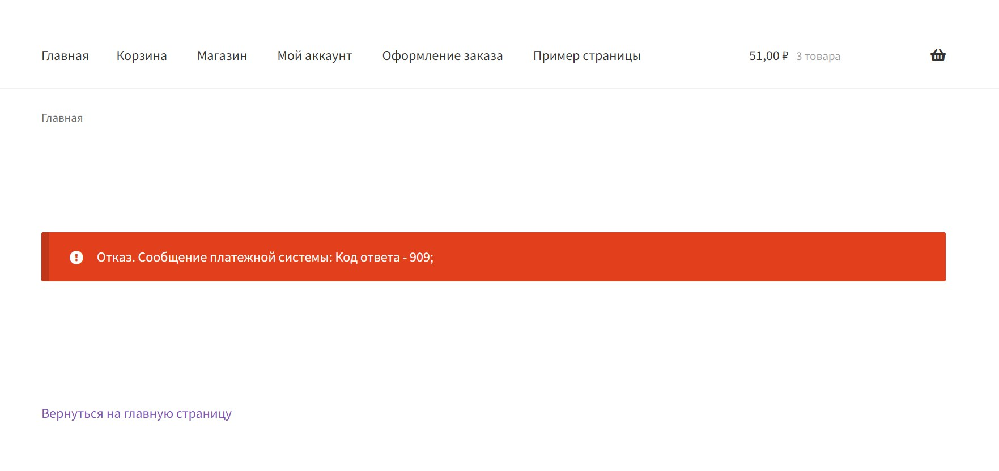

# Официальный платежный модуль банка Русский Стандарт для WordPress WooCommerce.

Модуль позволит принимать вашему интернет-магазину принимать платежи при помощи эквайринга банка Русский Стандарт, вы получите следующие возможности:

*   Предоставление покупателю способа оплаты заказа своей банковской картой;
*   Возможность автоматической генерации онлайн-чека;
*   Автоматическое определение налоговой ставки у продукта в чеке среди стандартных ставок НДС: 0%, 10%, 20%, без налога;
*   Протоколирование всех произведенных платежным модулем банковских транзакций;
*   Отдельная страница протокола и управления банковскими транзакциями;
*   Возможность обновления информации о любой банковской транзакции в любой момент;
*   Хранение и ведение актуального состояния чека (с учетом произведенных возвратов в заказе);
*   Возможность ведения лог-файла для отладки запросов в банк;
*   Возможность произведения возврата денежных средств за заказ;
*   Возможность произведения частичного возврата денежных средств за заказ при помощи выбора возвращаемых отдельных позиций товаров.

Вы можете выбрать в настройках модуля, в каком режиме должен будет работать модуль а также загрузить необходимые файлы сертификатов для организации защищенного обмена информацией с банком.

***Внимание!*** *Для работы этого платежного модуля необходимо заключить договор с банком Русский Стандарт.*

## Установка

1. Скачайте и распакуйте [архив](https://bitbucket.org/rsb-ipol/rsb-payment/get/master.zip) с модулем;
1. Его содержимое скопируйте в директорию /wp-content/plugins/rsb-payment/ Вашего сайта;
1. Активируйте плагин на странице "Плагины" WordPress;
1. Перейдите на страницу "WooCommerce / Настройки / Платежи / Эквайринг банка Русский Стандарт", нажмите кнопку "Управление", находящуюся в строке модуля и произведите настройку плагина;
1. После выбора правильного набора адресов для работы (в соответствии с полученной информацией от банка) и загрузки необходимых файлов сертификатов, можно начинать принимать платежи.

## Скриншоты

1. 
1. 
1. 
1. 
1. 
1. 